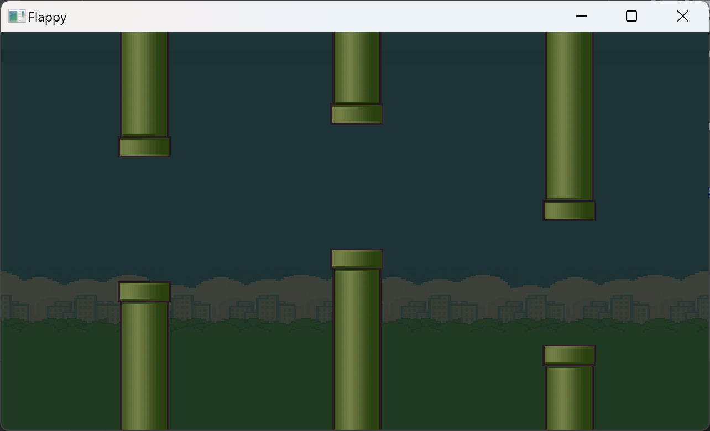

# 飞翔的小鸟
## 根据Youtube的Cherno所写，是一个使用Lwjgl3和OpenGL的项目。其中一些api被替换了还是询问了ChatGPT才解决问题。
[Let's Make Flappy Bird! (LWJGL 3 / OpenGL)](https://www.youtube.com/watch?v=527bR2JHSR0)

Github源码地址
[TheCherno/Flappy](https://github.com/TheCherno/Flappy)

按住空格键既可起飞，当发生碰撞的时候，游戏已经结束了。
需要重新按空格键既可开始游戏。
